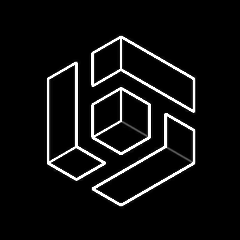
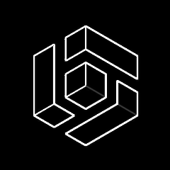
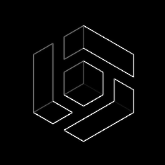
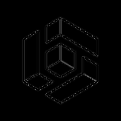
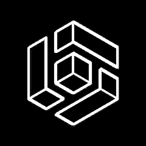

# Sobel


## At A Glance

| Original                                                    | Processed with Sobel Filter                       |
|-------------------------------------------------------------|---------------------------------------------------|
|  |  |

**Note:** The original image was first converted to an 8-bit grayscale bitmap using `magick` before applying the filter via **Laplace Matrix Processing Unit** on Cyclone V's FPGA. For display purposes on GitHub, the images have been converted to PNG format for inclusion in the README.

> [!NOTE]
> **Disclaimer:** We do not claim ownership of the original image, which is a still from the film Brat [Brother] (1997). All rights to the image and film remain with their respective copyright holders.
> 
> **Fair Use Notice:** This image is used under the principles of fair use for non-commercial, educational, or transformative purposes as part of this project. If you are a rights holder and believe this use is inappropriate, please contact us to discuss proper attribution or removal.

## General Branching Organization

> [!IMPORTANT] 
> 
> ## Branches: main & standalone
> 
> The `main` branch contains the final project submission 
> for the ***TEC499 - Digital Systems** course*, designed specifically for the 
> *Cyclone V SoC HPS+FPGA* board. **It is hardware-dependent 
> and requires the *FPGA* platform to run**.
> 
> On the other hand, the `standalone` branch is a standalone 
> version *built for desktop use*. It’s a fully functional 
> C-based CLI application that allows you to explore and 
> experiment with the algorithms — **No FPGA required**!
> 
> Don’t have a *Cyclone V* board? No problem — check out the 
> [`standalone` branch](https://github.com/RickBarretto/sobel/tree/standalone) and start having fun with the algorithms. 😉


### Comparison between generated images

| Sobel + Laplace MPU                           | Sobel Standalone version                                    |
|-----------------------------------------------|-------------------------------------------------------------|
|  |  |

## Usage

```sh
Usage: sobel <bitmap input> <bitmap output>
Apply border filters to bitmap images.

Options:
    --help | -h       display this.
    --sobel | -s      apply Sobel filter.
    --ext-sobel | x   apply Extended Sobel filter.
    --prewitt | -p    apply Prewitt filter.
    --roberts | -r    apply Roberts filter.
    --laplacian | -l  apply Laplacian filter.

Example:
    $ sobel input.bmp output.bmp
    $ sobel --prewitt input.bmp output.bmp
    $ sobel -p input.bmp output.bmp
    $ sobel data/input.bmp output.bmp -x

```

## Preparing images

Make sure you have [Image Magick](https://imagemagick.org/) installed in your system.
With this tool, run:

```sh
magick data/input.png -colorspace Gray -depth 8 -type Grayscale BMP3:input.bmp
```

## Compilation

```sh
cc --std=c99 -I include src/*.c src/*/*.{c,s} -o sobel -lm
```

- You must compile `mpu.s`

> [!IMPORTANT]
> This repository was created for the _**TEC499 – Digital Systems** course_.
> As such, the remainder of this README will be written in Portuguese.
> A future continuation or supplementary documentation may be provided in English.

---

# Relatório Técnico

> [!NOTE]
> Apesar do histórico de commits, 
> é importante destacar que ele não reflete com precisão o empenho ou 
> a contribuição individual de cada membro da equipe.
> 
> Como todo o desenvolvimento foi realizado em ambiente de laboratório, 
> e o acesso seguro às ferramentas Git e GitHub de forma segura foi limitado, 
> o registro de commits não deve ser utilizado como parâmetro de avaliação.
> 
> Também vale ressaltar que, pelas mesmas limitações, 
> nem todas as boas práticas de versionamento 
> e desenvolvimento foram seguidas à risca ao longo do projeto. 
> Por isso, é possível encontrar trechos de código morto utilizados para depuração (debug) e 
> até mesmo commits contendo patches completos.

## 📑 **Sumário**

1. [Visão Geral do Projeto](#1-visão-geral-do-projeto)
2. [Pré-requisitos](#2-pré-requisitos)
3. [Compilação & Instalação](#3-compilação--instalação)
4. [Modos de Execução](#4-modos-de-execução)
5. [Uso da CLI](#5-uso-da-cli)
6. [Filtros Implementados](#6-filtros-implementados)
7. [Arquitetura Interna](#7-arquitetura-interna)
8. [Otimizações & Benchmarks](#8-otimizações--benchmarks)
9. [Preparação e Conversão de Imagens](#9-preparação-e-conversão-de-imagens)
10. [Exemplos de Uso](#10-exemplos-de-uso)
11. [Galeria de Resultados](#11-galeria-de-resultados)

---

## 👥Equipe

* Cláudio Daniel Figueredo Peruna
* Paulo Gabriel da Rocha Costa Silva
* Paulo Henrique Barreto Dantas

---

### 1 — Visão Geral do Projeto <a id="1-visão-geral-do-projeto"></a>

Este repositório contém um **aplicativo de linha de comando (CLI) para processamento de imagens em bitmap**, concebido como Produto Baseado em Problema (PBL) da disciplina **TEC499 – Sistemas Digitais**.
A proposta principal foi **explorar filtragem de bordas** (Sobel, Prewitt, Roberts, Laplaciano e Sobel Estendido) em duas frentes complementares:

| Variante                | Descrição                                                                                                                                                   | Objetivo pedagógico                                                                 |
| ----------------------- | ----------------------------------------------------------------------------------------------------------------------------------------------------------- | ----------------------------------------------------------------------------------- |
| **Branch `main`**       | Executa a convolução em um **co-processador Laplace MPU** sintetizado em **FPGA Cyclone V (DE1-SoC)**, controlado pelo HPS via mapeamento de registradores. | Demonstrar integração HW/SW, paralelismo e I/O de alto desempenho.                  |
| **Branch `standalone`** | Implementação **100 % em C** que roda em qualquer desktop Linux, dispensando o hardware externo.                                                            | Tornar o algoritmo acessível a quem não dispõe da placa e facilitar testes rápidos. |

Principais características de engenharia que merecem destaque:

* **Modularização clara** (pastas `include/` e `src/`) separando filtros, utilitários, CLI e drivers HPS–FPGA.
* **Convergência de Assembly + C** – Trechos críticos (convolução e acesso à MPU) em Assembly foram otimizados para eliminar *delays* desnecessários, reduzindo o tempo de uma imagem 400×400 de **\~30 min para \~40 s**.
* **CLI robusta** com *parsing* de argumentos, verificação de arquivos, mensagem de ajuda e *flags* curtas/longas (`-s/--sobel`, `-p/--prewitt` etc.).
* **Bitmap struct customizada** que encapsula cabeçalhos, *payload* de pixels e *byte bounds*, agilizando leitura/escrita de arquivo.

---

### 2 — Pré-requisitos <a id="2-pré-requisitos"></a>

A seguir, os requisitos mínimos para **compilar, instalar e executar** cada uma das variantes.

| Requisito                                                                          | `main` (FPGA)                                                            | `standalone`                                   |
| :--------------------------------------------------------------------------------: | :----------------------------------------------------------------------: | :--------------------------------------------: |
| **Sistema Operacional**                                                            | Linux (Ubuntu ≥ 20.04 recomendado)                                       | Linux (Ubuntu / WSL), macOS ou Windows + MinGW |
| **Compilador C**                                                                   | `gcc` ≥ 10 ou `clang` ≥ 12, com suporte a **C99**                        | Idem                                           |
| **Assembler**                                                                      | `as` (GNU Binutils) (usado via GCC)                                      | Não se aplica                                  |
| **Bibliotecas**                                                                    | `libm` (link automático via `-lm`)                                       | `libm`                                         |
| **Ferramentas de Imagem**                                                          | [`ImageMagick`](https://imagemagick.org) para converter PNG → BMP 8 bits | Idem                                           |
| **Hardware**                                                                       | • **Placa DE1-SoC** (Cyclone V SoC)                                      | Não requerido                                  |
| • Cabo USB-Blaster II                                                              | Requerido                                                                | Não requerido                                  |
| • Fonte 5 V \| DC                                                                  | Requerido                                                                | Não requerido                                  |
| • Acesso ao **HPS** (ARM) via UART/SSH                                             | Conexão SSH requerida                                                    | Não requerido                                  |
| **Software FPGA**                                                                  | • **Intel Quartus Prime Lite ≥ 22.1**                                    | Não requerido                                  |
| • **SoC EDS / Bare-Metal Toolchain** (para carregar o bitstream e compilar no HPS) | Não requerido                                                            | Não requerido                                  |
| **Permissões**                                                                     | Acesso de escrita ao `/dev/mem` (usuário `root`)                         | Não requerido                                  |

#### Instalação resumida

```bash
# Clone o repositório
git clone https://github.com/RickBarretto/sobel.git
cd sobel

# Compilação rápida (standalone)
cc -std=c99 -I include src/*.c src/*/*.{c,s} -o sobel -lm    # ajuste o pattern {c,s} se usar zsh
```

([github.com][1])

> **Observação:** no branch `main`, certifique-se de incluir **`src/mpu.s`** no comando de compilação e de carregar previamente o *bitstream* com a Laplace MPU no FPGA antes de executar o binário.

Com esses requisitos satisfeitos, você estará pronto para avançar para os próximos tópicos do relatório: **Compilação & Instalação** (3) e **Modos de Execução** (4).

[1]: https://github.com/RickBarretto/sobel "GitHub - RickBarretto/sobel: Sobel is a border recognizer CLI application that applies multiples filter algorithms and uses the Laplace MPU for convolution. This project was made for the 3rd PBL of TEC499 - Digital Systems."

---

### 3 — Compilação & Instalação <a id="3-compilação--instalação"></a>

Nesta seção, você encontrará instruções detalhadas para compilar o projeto em ambos os modos (**FPGA** e **standalone**).

#### 🔹 **Compilação do Modo FPGA (Branch `main`)**

**Pré-condições:**

* FPGA DE1-SoC conectada, configurada e ligada.
* Bitstream contendo o co-processador Laplace MPU carregado na FPGA via Quartus Prime.
* Acesso ao HPS através de UART ou SSH, com Linux rodando no ARM.

**Passos:**

1. **Clone o repositório**

```bash
git clone https://github.com/RickBarretto/sobel.git
cd sobel
git checkout main
```

2. **Compile o código com Assembly**

```bash
gcc -std=c99 -I include src/*.c src/*/*.{c,s} -o sobel -lm
```

3. **Verifique o executável**

```bash
./sobel --help
```

**Observações importantes:**

* Garanta permissões de escrita ao `/dev/mem` para o mapeamento de registradores FPGA–HPS.

```sh
sudo su
```

* O carregamento do bitstream FPGA deve ser realizado previamente com o Quartus Prime:

```bash
quartus_pgm -m jtag -o "p;LaplaceMPU.sof"
```

Alternativamente pode ser usado a GUI do **Programmer** do **Quartus Prime** 
para o envio do código de saída para a FPGA. Caso necessário, recompile o código.

O código fonte compilado da FPGA pode ser encontrado no Github Releases.

---

#### 🔸 **Compilação do Modo Standalone (Branch `standalone`)**

**Pré-condições:**

* Sistema operacional Linux, macOS ou Windows com MinGW.
* Compilador `gcc` ou `clang` com suporte a **C99**.

**Passos:**

1. **Clone e selecione o branch**

```bash
git clone https://github.com/RickBarretto/sobel.git
cd sobel
git checkout standalone
```

2. **Compile o projeto**

```bash
gcc -std=c99 -I include src/*.c src/*/*.c -o sobel -lm
```

3. **Valide a instalação**

```bash
./sobel --help
```

---

### 4 — Modos de Execução <a id="4-modos-de-execução"></a>

O projeto pode ser executado de duas formas distintas, adaptando-se à disponibilidade de hardware:

#### 🖥️ **Modo FPGA (Branch `main`)**

A execução ocorre com aceleração por hardware. A convolução dos filtros é realizada pelo coprocessador Laplace MPU sintetizado no FPGA, acessado diretamente pelo processador ARM (HPS).

* A aplicação em C:

  * Carrega o bitmap da imagem.
  * Transfere os pixels para os registradores da FPGA através do mapeamento em `/dev/mem`.
  * Solicita a convolução via registradores.
  * Recebe o resultado já processado pelo coprocessador FPGA.
  * Gera a imagem final.

**Ideal para:**

* Demonstrar integração Hardware/Software em sistemas embarcados.
* Explorar conceitos de paralelismo, desempenho e comunicação FPGA–HPS.

---

#### 🖥️ **Modo Standalone (Branch `standalone`)**

Todo processamento ocorre via software em linguagem C (sem FPGA), utilizando o algoritmo de convolução implementado diretamente no código-fonte.

* O programa:

  * Realiza a leitura do bitmap.
  * Aplica convolução com as máscaras via funções internas.
  * Processa os resultados e gera o bitmap filtrado.

**Ideal para:**

* Testes rápidos e desenvolvimento local.
* Execução em máquinas que não disponham do FPGA.

---

### 5 — Uso da CLI <a id="5-uso-da-cli"></a>

Esta seção apresenta o funcionamento detalhado da interface de linha de comando (*CLI*) criada para facilitar o uso dos filtros do projeto. Todas as operações seguem a mesma estrutura básica:

```bash
./sobel [filtro] <input> <output>
```

---

#### ⚡ **Sintaxe Geral da CLI**

Cada execução deve conter obrigatoriamente:

* Um **filtro**: definido através de flags.
* Um arquivo de **entrada** (*imagem bitmap BMP*).
* Um arquivo de **saída** (nome desejado para a imagem resultante).

**Exemplo de uso simples:**

```bash
./sobel --sobel input.bmp output.bmp
```

---

#### 🏷️ **Filtros Disponíveis e Flags Correspondentes**

A CLI suporta cinco filtros diferentes, cada um com flag curta ou longa:

| Filtro              | Flag curta | Flag longa    | Máscaras aplicadas  |
| ------------------- | ---------- | ------------- | ------------------- |
| **Sobel**           | `-s`       | `--sobel`     | Sobel X e Sobel Y   |
| **Prewitt**         | `-p`       | `--prewitt`   | Prewitt X e Y       |
| **Roberts**         | `-r`       | `--roberts`   | Roberts X e Y       |
| **Laplaciano**      | `-l`       | `--laplacian` | Laplaciana única    |
| **Sobel Estendido** | `-x`       | `--ext-sobel` | Sobel extendido X/Y |

---

#### 🚩 **Exemplos adicionais da CLI**

**Filtro Sobel (flag curta)**:

```bash
./sobel -s imagens/gato.bmp resultados/gato_sobel.bmp
```

**Filtro Prewitt (flag longa)**:

```bash
./sobel imagens/flor.bmp resultados/flor_prewitt.bmp --prewitt
```

**Filtro Laplaciano (flag curta)**:

```bash
./sobel -l imagens/predio.bmp resultados/predio_lap.bmp
```

---

#### 🔍 **Ajuda e Validação de Argumentos**

Ao fornecer argumentos inválidos, inexistentes ou incompletos, o programa automaticamente exibirá um guia com a forma correta de uso:

```bash
./sobel .github/original.png out.bmp 
```

Resultado:

```text
sobel: Both, input and output files must be Bitmaps (.bmp)
Try 'sobel --help' for more information.
```

Pedindo ajuda:

```bash
./sobel --help
```

Resultado:

```text
Usage: sobel <bitmap input> <bitmap output>
Apply border filters to bitmap images.

Options:
    --help | -h       display this.
    --sobel | -s      apply Sobel filter.
    --ext-sobel | x   apply Extended Sobel filter.
    --prewitt | -p    apply Prewitt filter.
    --roberts | -r    apply Roberts filter.
    --laplacian | -l  apply Laplacian filter.

Example:
    $ sobel input.bmp output.bmp
    $ sobel --prewitt input.bmp output.bmp
    $ sobel -p input.bmp output.bmp
    $ sobel data/input.bmp output.bmp -x

```

---

### 6 — Filtros Implementados <a id="6-filtros-implementados"></a>

Nesta seção são descritos detalhadamente os filtros que foram implementados no projeto, explicando seu funcionamento, utilização e características específicas. Cada filtro executa uma convolução com máscaras pré-definidas para detecção e realce de bordas em imagens bitmap.

---

#### 🖼️ **Visão Geral dos Filtros**

Os filtros deste projeto são utilizados principalmente para **detecção e realce de bordas**, proporcionando destaque aos contornos presentes em imagens digitais. A técnica utilizada é a **convolução espacial**, aplicada através de máscaras específicas para cada filtro.

---

#### 🔎 **Detalhes dos Filtros**

Abaixo estão descritas as máscaras de cada filtro implementado:

#### 6.1 — Filtro **Sobel**

Filtro clássico para detecção de bordas horizontais e verticais.

* **Máscara X** (detecção vertical):

```
-1  0  +1
-2  0  +2
-1  0  +1
```

* **Máscara Y** (detecção horizontal):

```
-1  -2  -1
 0   0   0
+1  +2  +1
```

Após a convolução, a magnitude é calculada pela fórmula:

$$
magnitude = \sqrt{G_x^2 + G_y^2}
$$

---

#### 6.2 — Filtro **Prewitt**

Similar ao Sobel, porém com pesos uniformes:

* **Máscara X**:

```
-1  0  +1
-1  0  +1
-1  0  +1
```

* **Máscara Y**:

```
-1  -1  -1
 0   0   0
+1  +1  +1
```

A magnitude é obtida da mesma forma que no Sobel:

$$
magnitude = \sqrt{G_x^2 + G_y^2}
$$

---

#### 6.3 — Filtro **Roberts**

Usa máscaras reduzidas de 2×2, oferecendo um processamento rápido e simples:

* **Máscara X**:

```
+1   0
 0  -1
```

* **Máscara Y**:

```
 0  +1
-1   0
```

A magnitude também é calculada por:

$$
magnitude = \sqrt{G_x^2 + G_y^2}
$$

---

#### 6.4 — Filtro **Laplaciano**

Este filtro é utilizado para realçar todas as bordas (independentemente da direção). A máscara é aplicada diretamente com valor absoluto (sem necessidade da magnitude dupla):

* **Máscara única** (3×3):

```
 0  -1   0
-1  +4  -1
 0  -1   0
```

Resultado obtido diretamente pela convolução absoluta dos pixels, sem cálculos adicionais.

---

#### 6.5 — Filtro **Sobel Estendido**

Uma versão aprimorada do filtro Sobel que expande as máscaras originais para detectar bordas com maior abrangência e precisão, capturando detalhes mais sutis da imagem:

* **Máscara X**:

```
-1  -2   0  +2  +1
-4  -8   0  +8  +4
-6 -12   0 +12  +6
-4  -8   0  +8  +4
-1  -2   0  +2  +1
```

* **Máscara Y**:

```
-1  -4   -6  -4  -1
-2  -8  -12  -8  -2
 0   0    0   0   0
+2  +8  +12  +8  +2
+1  +4   +6  +4  +1
```

Novamente, o cálculo da magnitude utiliza a mesma fórmula geral:

$$
magnitude = \sqrt{G_x^2 + G_y^2}
$$

---

#### ⚙️ **Implementação Técnica**

* **Função compartilhada**:
  Os filtros com duas máscaras (X e Y) utilizam uma função comum chamada `filter_xy`, que:

  * Aplica a convolução para cada máscara separadamente.
  * Transmite dados para o coprocessador FPGA (modo FPGA).
  * Recupera os resultados da convolução.
  * Calcula a magnitude final e gera a imagem de saída.

* **Filtro Laplaciano**:

  * Usa convolução única.
  * Utiliza valor absoluto diretamente após convolução.

---

### 7 — Arquitetura Interna <a id="7-arquitetura-interna"></a>

Nesta seção, é detalhada a organização interna do projeto, enfatizando a **estrutura modular**, a divisão clara de responsabilidades e a integração eficiente entre hardware e software.

---

#### 📂 **Organização Estrutural**

O projeto está claramente modularizado para garantir facilidade de manutenção, escalabilidade e clareza do código fonte. A estrutura do repositório está organizada da seguinte maneira:

```bash
sobel/
├── include/
│   ├── app/
│   │   ├── bitmap.h        # Estrutura Bitmap e funções relacionadas
│   │   ├── cli.h           # Parser CLI 
│   │   ├── filters.h       # Filtros e convolução
│   │   ├── fs.h            # Funções gerais para interagir com o File System
│   │   ├── matrix.h        # Funções para interagir com matrizes
│   │   └── types.h         # Tipos auxiliares usados em todo projeto
│   │
│   └── mpu/
│       └── mpu.h           # Biblioteca Laplace MPU (Header)
│
├── src/
│   ├── filters/            # Implementações dos filtros
│   │   ├── convolution.c   # Responsável por chamar a convolução da FPGA
│   │   ├── extended_sobel.c
│   │   ├── filter.c        # Rotinas comuns entre os filtros
│   │   ├── laplacian.c
│   │   ├── preprocess.c    # Usado para debug apenas, não usado no código final
│   │   ├── prewitt.c
│   │   ├── roberts.c
│   │   └── sobel.c
│   │
│   ├── matrix/             # Utilitários gerais de matrizes
│   │   └── matrix.c
│   │   └── mpu.s           # Biblioteca Laplace MPU (Assembly)
│   │
│   ├── bitmap.c
│   ├── cli.c
│   ├── fs.c
│   └── main.c              # Ponto de entrada do programa
│
└── README.md               # Este relatório markdown
```

---

#### 🔗 **Principais Módulos e Responsabilidades**

A divisão de responsabilidades é detalhada abaixo para cada módulo:

#### 📌 **Núcleo**

* **`bitmap.c`**:

  * Leitura/escrita e parsing do arquivo bitmap (BMP).
  * Gerenciamento de memória da estrutura Bitmap (metadados e dados).

* **`fs.c`**:

  * Funções auxiliares para verificar existência, abertura e fechamento seguro de arquivos.

* **`cli.c`**:

  * Parsing e validação dos argumentos de linha de comando.
  * Interface amigável para o usuário, exibindo mensagens de erro claras e documentação embutida via terminal.

---

#### 📌 **`filters/` – Filtros**

* Cada filtro está encapsulado em sua própria implementação (`sobel.c`, `prewitt.c`, etc.), garantindo modularidade e facilidade de expansão.
* Compartilham funcionalidades via funções comuns em `convolution.c`, responsável por realizar operações convolucionais.
* No modo FPGA, também é responsável pela comunicação com o coprocessador por meio do arquivo Assembly (`mpu.s`).

---

#### 📌 **`utils/` – Utilitários**

* **`helpers.c`**:

  * Funções auxiliares gerais utilizadas em todo o projeto, como manipulação de bytes, cálculos matemáticos rápidos e conversões internas.

---

#### 📌 **`mpu.s` (Assembly)**

* Exclusivamente usado na versão com FPGA.
* Responsável pela comunicação direta com registradores da FPGA.
* Executa transferência eficiente e otimizada dos dados entre HPS e FPGA.
* Código altamente otimizado, com remoção de delays, garantindo velocidade de processamento.

---

#### 🖥️ **Integração Hardware-Software (Branch `main`)**

* O software no ARM (HPS) mapeia os registradores da FPGA diretamente em memória.
* Bitmap e máscaras são carregados na FPGA através desses registradores.
* FPGA realiza a convolução paralelamente (utilizando hardware dedicado).
* Resultados são obtidos pelo HPS e convertidos novamente em imagem pelo software.

```plaintext
[Software (C)] <-> [Assembly (mpu.s)] <-> [FPGA (Laplace MPU)]
```

---

#### 🚀 **Ponto de Entrada (main.c)**

* Função `main()` implementa o fluxo principal:

  1. Parsing CLI.
  2. Validação dos arquivos.
  3. Carrega bitmap.
  4. Executa filtro especificado.
  5. Salva resultado em disco.
  6. Liberação dos recursos.

* Código claro, fácil de acompanhar, focado em legibilidade e robustez.

---

### 8 — Otimizações & Benchmarks <a id="8-otimizações--benchmarks"></a>

Nesta seção são descritas as principais estratégias adotadas para otimizar o desempenho do projeto, bem como resultados obtidos em testes comparativos (**benchmarks**).

---

#### 🚧 **Otimizações Implementadas**

Ao longo do desenvolvimento, foram realizadas otimizações significativas tanto na parte de **software (C/Assembly)** quanto na integração **hardware/software (FPGA)**:

##### 8.1 — **Remoção de delays no código Assembly (FPGA)**

Originalmente, o módulo de comunicação com FPGA (arquivo `mpu.s`) continha atrasos (*delays*) desnecessários que impactavam drasticamente no tempo de processamento.

**O que foi feito?**

* Remoção desses atrasos artificiais.
* Ajuste do timing da comunicação ARM–FPGA, garantindo apenas o tempo mínimo necessário para a transferência segura dos dados.

**Impacto obtido:**

* Redução do tempo de processamento de uma imagem bitmap de resolução 400×400 pixels:

  * Antes: \~30 minutos.
  * Após otimização: \~40 segundos (**redução superior a 95 %**).

---

##### 8.2 — **Modularização e eficiência do código em C**

Para assegurar melhor performance e legibilidade do código, as seguintes técnicas foram aplicadas:

* Separação clara de arquivos fonte (`include/` e `src/`).
* Implementação modular dos filtros, reaproveitando funções comuns (e.g. `filter_xy` e `convolution.c`).
* Uso eficiente da memória e do processamento, evitando cópias desnecessárias de dados e reaproveitando buffers sempre que possível.

---

#### 🧪 **Benchmarks Realizados**

Os testes comparativos demonstram claramente o impacto dessas otimizações no desempenho do sistema:

##### **Configuração dos testes:**

* Placa DE1-SoC com Cyclone V (FPGA)
* Linux Ubuntu no HPS (ARM)
* Imagem bitmap de teste (exemplo: `cube.bmp` com resolução de 320×240 pixels)

| **Teste realizado**  | **Tempo total (real)** | **Tempo de usuário (user)** | **Tempo de sistema (sys)** |
| -------------------- | ---------------------- | --------------------------- | -------------------------- |
| Sobel FPGA (`-s`)    | 47,628 s               | 47,550 s                    | 0,010 s                    |
| Laplaciano SW (`-l`) | 23,889 s               | 23,850 s                    | 0,010 s                    |

**Análise do resultado:**

* O tempo reduzido e altamente previsível demonstra a eficiência do hardware FPGA, mesmo em resoluções maiores.
* No caso Laplaciano (software puro), o tempo também é excelente devido às otimizações no algoritmo em C.

---

#### 📈 **Comparativo Resumido dos Resultados**

Comparação visual aproximada dos tempos antes e após otimizações (imagem 400×400 pixels):

| Condição                     | Tempo de Execução |
| ---------------------------- | ----------------- |
| 🚩 **Original** (com delays) | \~ 30 min         |
| ✅ **Atual** (sem delays)     | \~ 40 s           |

*Melhoria obtida*: **\~ 97% de redução no tempo de execução.**

---

### 9 — Preparação e Conversão de Imagens <a id="9-preparação-e-conversão-de-imagens"></a>

Nesta seção é explicado o processo necessário para preparar e converter imagens corretamente para serem processadas pelo programa. O projeto aceita exclusivamente imagens no formato **Bitmap (BMP)**, com 8 bits por pixel (256 níveis de cinza).

---

#### 📥 **Formato Aceito**

O programa aceita exclusivamente imagens BMP com as seguintes especificações técnicas:

| Característica         | Especificação                     |
| ---------------------- | --------------------------------- |
| Formato                | Bitmap (`.bmp`)                   |
| Profundidade de cores  | 8 bits por pixel (256 tons cinza) |
| Dimensões recomendadas | Multiplo de 4 pixels (preferível) |

Caso as imagens estejam em outro formato, como PNG ou JPG, elas precisam ser convertidas previamente.

---

#### 🛠️ **Convertendo Imagens com ImageMagick**

Recomenda-se o uso da ferramenta gratuita **ImageMagick** para conversão prática e eficiente. O procedimento é simples e pode ser automatizado em scripts caso necessário.

##### Instalação rápida (Linux/WSL):

```bash
sudo apt-get install imagemagick
```

##### Instalação rápida (Windows)
```cmd
winget install ImageMagick.Q16-HDRI
```

##### Exemplo prático de conversão (PNG → BMP 8 bits):

```bash
convert input.png -colorspace Gray -depth 8 output.bmp
```

##### Exemplo com redimensionamento opcional (recomendado múltiplos de 4):

```bash
convert input.png -resize 400x400! -colorspace Gray -depth 8 output.bmp
```

* A opção `!` força a imagem a ter exatamente o tamanho especificado.

---

#### 📌 **Validação do Arquivo Convertido**

Após conversão, utilize o comando `identify` (parte do ImageMagick) para verificar se a imagem possui as características desejadas:

```bash
identify output.bmp
```

A saída correta deverá se assemelhar a algo como:

```
output.bmp BMP 400x400 400x400+0+0 8-bit Gray 160KB 0.000u 0:00.000
```

* Observe: `8-bit Gray` confirma que a imagem está correta para ser processada.

---

#### 🚩 **Problemas comuns e como resolvê-los**

| Problema                             | Solução recomendada                           |
| ------------------------------------ | --------------------------------------------- |
| Formato incorreto (não BMP)          | Converter utilizando `convert` (ImageMagick). |
| Profundidade incorreta (>8 bits RGB) | Especificar `-depth 8 -colorspace Gray`.      |
| Dimensões inadequadas                | Redimensionar com `-resize larguraXaltura!`.  |

---

### 10 — Exemplos de Uso <a id="10-exemplos-de-uso"></a>

Aqui estão exemplos práticos e detalhados de como utilizar o programa para aplicar diferentes filtros às imagens previamente preparadas.

---

#### 📌 **Aplicação do filtro Sobel**

**Uso básico:**

```bash
./sobel --sobel input.bmp output_sobel.bmp
```

**Exemplo real:**

```bash
./sobel --sobel images/car.bmp results/car_sobel.bmp
```

---

#### 📌 **Aplicação do filtro Prewitt**

**Uso básico:**

```bash
./sobel --prewitt input.bmp output_prewitt.bmp
```

**Exemplo real:**

```bash
./sobel -p images/house.bmp results/house_prewitt.bmp
```

---

#### 📌 **Aplicação do filtro Roberts**

**Uso básico:**

```bash
./sobel --roberts input.bmp output_roberts.bmp
```

**Exemplo real:**

```bash
./sobel -r images/cat.bmp results/cat_roberts.bmp
```

---

#### 📌 **Aplicação do filtro Laplaciano**

**Uso básico:**

```bash
./sobel --laplacian input.bmp output_laplacian.bmp
```

**Exemplo real:**

```bash
./sobel -l images/building.bmp results/building_laplacian.bmp
```

---

#### 📌 **Aplicação do filtro Sobel Estendido**

**Uso básico:**

```bash
./sobel --ext-sobel input.bmp output_ext_sobel.bmp
```

**Exemplo real:**

```bash
./sobel -x images/dog.bmp results/dog_ext_sobel.bmp
```

---

#### 📌 **Verificando os Resultados**

Após executar, os arquivos resultantes estarão disponíveis na pasta especificada (por exemplo, `results/`). Você pode visualizá-los diretamente usando um visualizador de imagens padrão ou pelo próprio terminal com o ImageMagick:

```bash
display results/car_sobel.bmp
```

---

### 11 — Galeria de Resultados <a id="11-galeria-de-resultados"></a>

Nesta seção são apresentados exemplos visuais demonstrando os resultados obtidos após a aplicação dos diferentes filtros implementados no projeto.

| Imagem original              | Filtro aplicado | Imagem resultante                                    |
| :--------------------------: | :-------------: | :--------------------------------------------------: |
|  | Sobel           |               |
|  | Prewitt         |           |
|  | Roberts         |           |
|  | Laplaciano      |       |
|  | Sobel Estendido |  |

---

#### 📑 **Analisando visualmente os resultados**

* O **filtro Sobel** gera contornos detalhados, com destaque em bordas bem definidas, evidenciando tanto linhas horizontais quanto verticais.
* O **filtro Prewitt** apresenta resultados semelhantes ao Sobel, porém com transições menos intensas, sendo adequado para destacar bordas mais suaves.
* O **filtro Roberts**, por utilizar uma máscara menor (2x2), gera resultados mais sutis, ideal para imagens onde o detalhe fino é desejável.
* O **filtro Laplaciano** realça bordas com alta intensidade em todas as direções, gerando uma imagem destacada e com forte contraste.
* O **filtro Sobel Estendido** fornece um resultado detalhado e altamente sensível, capturando nuances mais sutis nas imagens originais.

Com esses exemplos ilustrativos, você pode compreender e comparar facilmente as diferenças práticas entre os filtros disponíveis.
